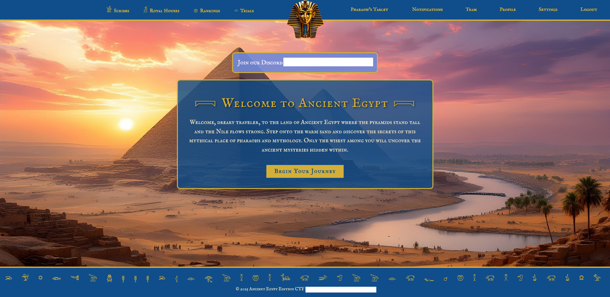
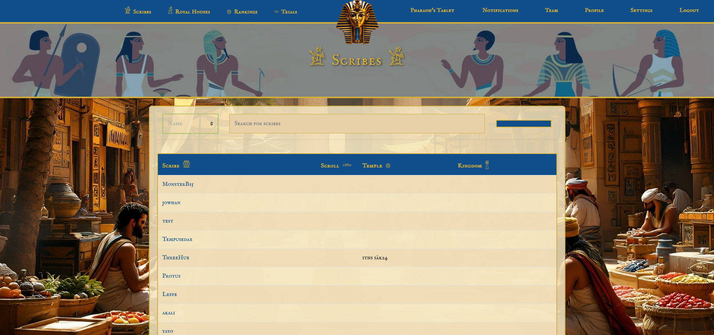
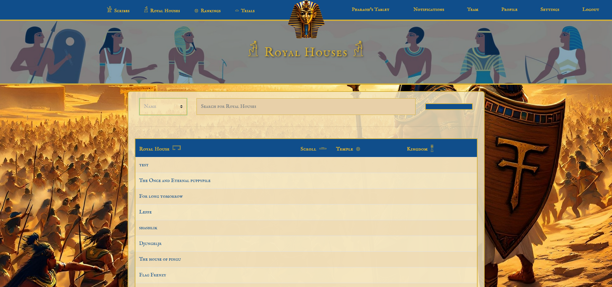
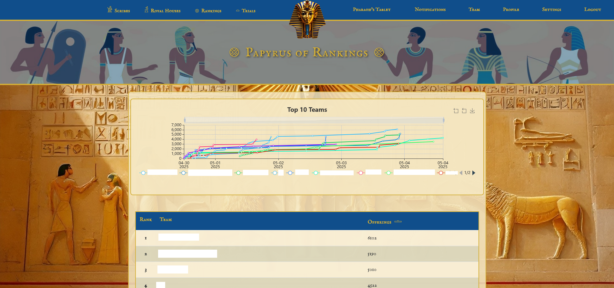
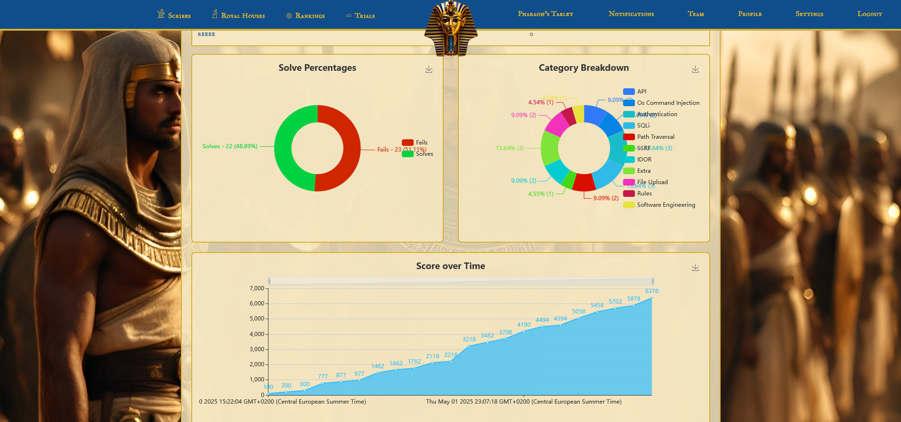
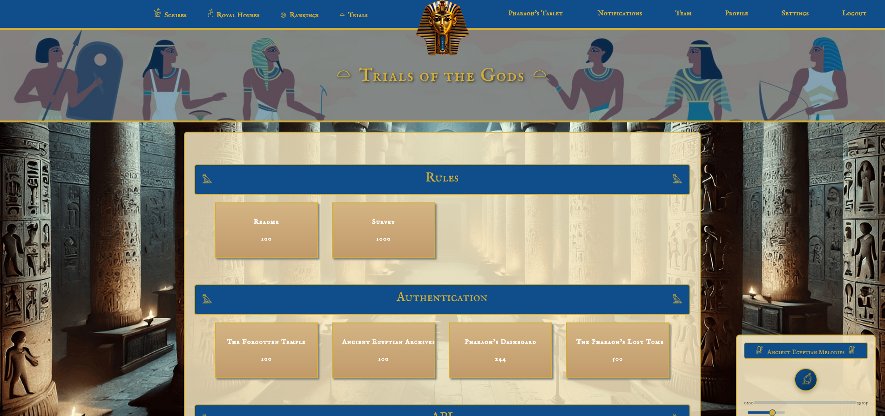

# Ancient Egypt CTFd Theme

This is a custom Ancient Egyptian-themed user interface for [CTFd](https://github.com/CTFd/CTFd), designed for a Capture The Flag event collaboratively built by four LIA (internship) students as part of our thesis project. The CTF was designed to engage students with IT backgrounds, although all were welcome to participate. The theme was fully designed and implemented by me and tested with CTFd version **3.7.6**.

<div align="center">
  
  <p><em>Custom front page (index)</em></p>
</div>

## 🎨 Overview

This theme transforms the default CTFd interface into a stylized, immersive Ancient Egyptian experience. Visual elements, music, and layout were carefully modified to create a unique and memorable learning environment. Key UI areas like the challenge board, team rankings, user stats, and authentication pages were redesigned.

**Highlights:**

- Custom backgrounds and visuals for all major pages.
- Background music toggle on the challenges page, featuring *"Flavor Cats"* from the *Age of Mythology* soundtrack.
- AI-generated imagery for page backgrounds and icons.
- Optional ancient-inspired favicon and logo support.

## 📸 Screenshots

| Page | Screenshot |
|------|------------|
| Index Page |  |
| Users Page |  |
| Teams Page |  |
| Scoreboard |  |
| Team Stats |  |
| Challenge Board (with music toggle) |  |

> Note: Sensitive content and organization names have been redacted from these screenshots for confidentiality.

## 🧩 Modified Files

The following template files were modified to support the new design:

**Main templates**  
`base.html`, `challenges.html`, `login.html`, `notifications.html`, `page.html`, `register.html`, `scoreboard.html`, `settings.html`

**Components**  
`components/navbar.html`

**Errors**  
`errors/403.html`, `404.html`, `429.html`, `500.html`, `502.html`

**Teams**  
`teams/join_team.html`, `new_team.html`, `private.html`, `public.html`, `team_enrollment.html`, `teams.html`

**Users**  
`users/private.html`, `public.html`, `users.html`

### 🖼 Static Assets

All images and audio are stored in the respective `static/img/` and `static/sounds/` folders.

#### `static/img/` includes:
- Custom backgrounds like `index.jpg`, `scoreboard.jpg`, etc.
- Icons and decorative elements such as `pharaoh-icon.png`, `mask.png`

#### `static/sounds/` includes:
- `bg.mp3` — Age of Mythology track used on the Challenges page

> ⚠️ All visual assets are AI-generated. The background music is from *Age of Mythology*. This repository is intended for educational/non-commercial use only. Licensing responsibility lies with the user.

## ⚙️ Installation

1. Clone this repo into your CTFd themes directory:

```bash
git clone https://github.com/Adam-Tew/CTFd-Ancient-Egyptian-Theme.git /path/to/CTFd/CTFd/themes/AncientEgypt
```

2. Go to the CTFd Admin Panel → Config → **Theme**  
3. Choose `AncientEgypt` (or your folder name) from the dropdown  
4. Scroll down and click **Update**

### Optional (for Docker users):

If the theme does not appear, copy the theme folder directly into the running container:

```bash
docker cp /path/to/CTFd/CTFd/themes/AncientEgypt <container_name>:/opt/CTFd/CTFd/themes/
```

### Setting the Favicon and Logo

1. Navigate to Admin Panel → Config → **Logo**
2. Under "Tab Icon", upload `mask.png`
3. Upload a custom logo if desired under the "Logo" section

## 📄 License & Credits

This theme was created by **Adam Tew** as part of an internship thesis project.  
You are free to use or adapt it for personal or educational purposes.

- Background music: *Flavor Cats* from *Age of Mythology*  
- All images are AI-generated  
- **No commercial license is provided** — users must verify licenses for third-party assets if used commercially.  
- I do not assume any legal responsibility.
